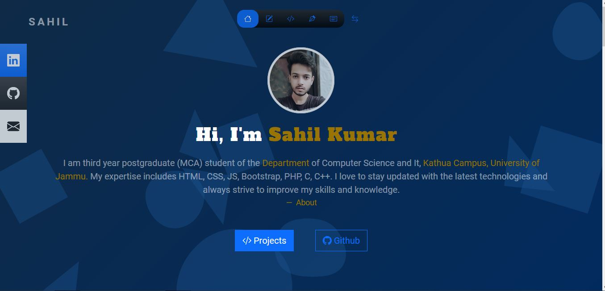
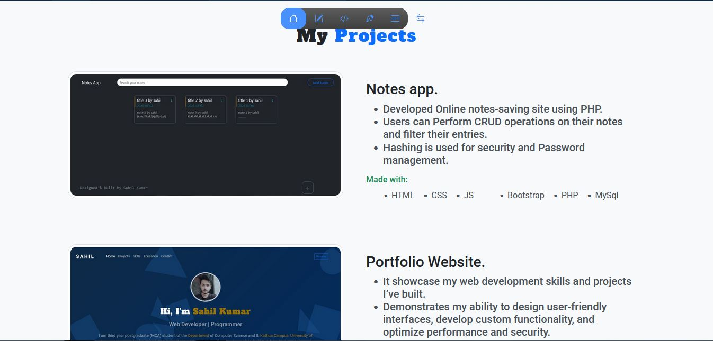
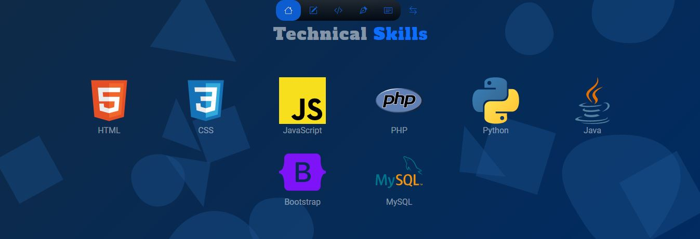
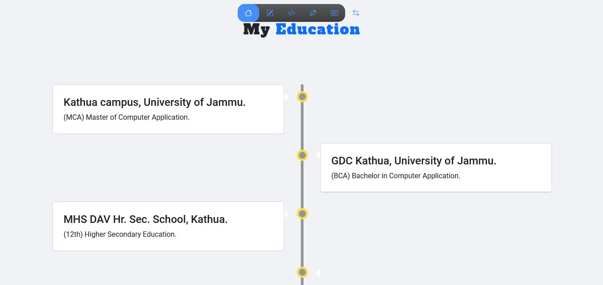
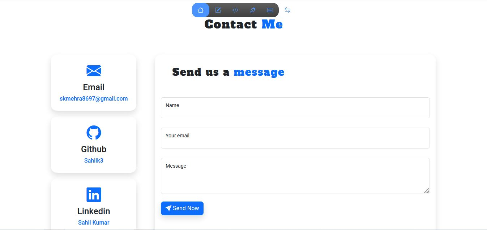

# Portfolio Website

This is a portfolio website project made using HTML, CSS, and Bootstrap. It showcases my skills, education, and projects. It also includes my social profiles like LinkedIn and GitHub, as well as an email contact form.

## Features

- Simple and easy-to-use interface
- Responsive design using Bootstrap
- Includes information about me, my skills, education, and projects
- Includes links to my social profiles on LinkedIn and GitHub
- Includes an email contact form

## Getting Started

To use the portfolio website, simply open the `index.html` file in your web browser. The website will load and you can start exploring.

## Sections

### Home

This section includes a brief introduction about myself, my interests, and my career goals.

### Projects

This section includes a list of my projects, along with descriptions and links to view them.

### Skills

This section includes a list of my technical skills.

### Education

This section includes information about my educational background, including my degree and any relevant coursework.

### Contact Me

This section includes links to my social profiles on LinkedIn and GitHub.

Also includes a contact form that can be used to send me an email.

## Live Demo

You can try the live demo of this project by clicking on the following link: [https://sahilk3.github.io/Portfolio/](https://sahilk3.github.io/Portfolio/)
